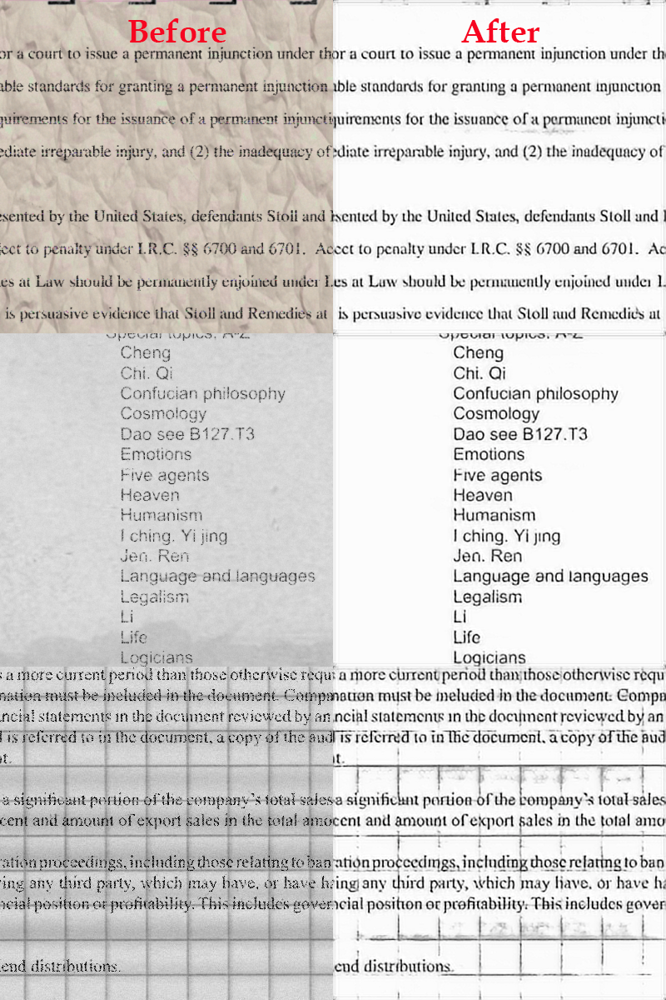

<details open>
<summary><h2>How it works</h2></summary>



</details>
<details open>
<summary><h2>Installation</h2></summary>
  
```
pip install cleanocr
```
 
</details>
<details open>
<summary><h2>Documentation</h2></summary>

```
import cv2
from cleanocr import denoise_ocr

image = cv2.imread('test.png')
result = denoise_ocr(image)
cv2.imwrite('result.png', result)
```

</details>
<details open>
<summary><h2>Contact</h2></summary>

Please reach out to me for your any projects in Python, Web Development and Computer Vision and NLP fields.
<div align="left">
<a target="_blank" href="https://t.me/jareddean"></a>
<a target="_blank" href="https://wa.me/+14422295661"></a>
<a target="_blank" href="https://join.slack.com/t/prenes/shared_invite/zt-1cx925fip-vL4nKJN64XBMbx8vdwHP7Q"></a>
<a target="_blank" href="skype:live:.cid.4b536a6c3cc88a8c?chat"></a>
</div>

</details>
